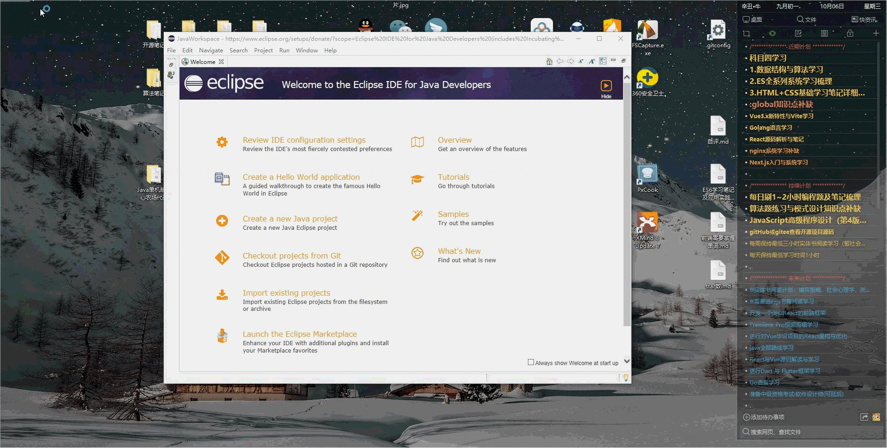
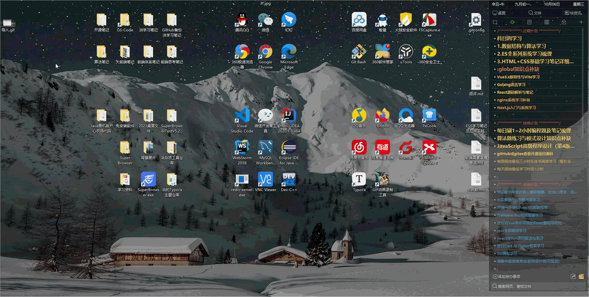
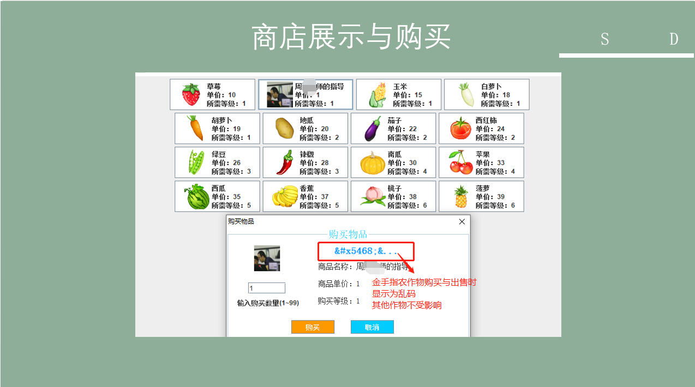
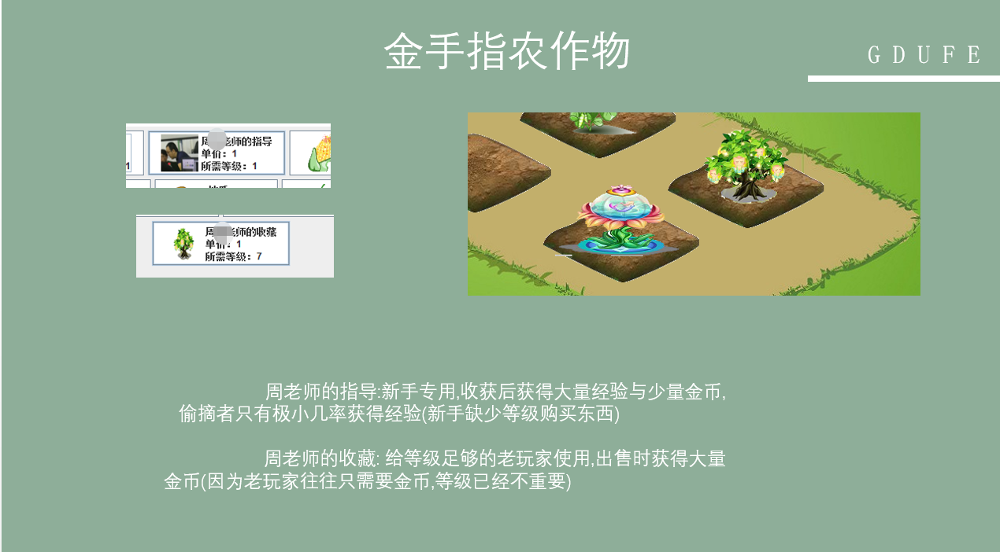

# 单机版开心农场项目

#### 介绍
使用 Java+JFrame 等相关知识开发一个单机电脑版的开心农场

#### 软件架构

1.  使用java中JFrame类相关知识进行可视化开发
2.  使用javase阶段知识进行项目开发
3.  本项目不连接数据库,而是使用 `IO流方式` 将数据写入本地文件进行数据永久化
4.  运用 `多线程` 知识点实现多土地农作物自动生长功能
5.  使用 `Eclipse` 软件进行编写,毕竟刚入大学2017年时 还是这个软件的天下(起码在学校中都是接触这个)

#### 使用说明

1.  直接运行即可
2.  相关思维导图、效果图、PPT已经传入tools文件夹中
3.  项目代码为`HappyFarm`

#### 声明

>1. 本项目为本人学习java阶段的练手项目,学生时期编写,所以代码抽出复用等优化部分并没有去注意,代码质量也不并不是很高,请多海涵
>2. `部分资源是教我Java的周老师给的jar包封好的,并非全部都是本人写的`.所以jar包部分的源码是没分享出来的哦
>3. 大体外观样式资源是教我Java的周老师给的,本人是使用JavaSE部分知识点实现如下思维导图功能

#### 思维脑图
  下面只展出部分效果图

#### Ⅰ- 导入

>

#### Ⅱ - 运行

> 

#### Ⅲ - 登录、注册

>

#### Ⅳ - 收菜、偷菜

> 

#### Ⅴ - 截图展示

PS:金手指农作物出售与购买时显示为 **乱码**  这样会更有气氛! 绝对不是当时中文乱码又没处理然后现在懒得改源码找的借口 🧐

